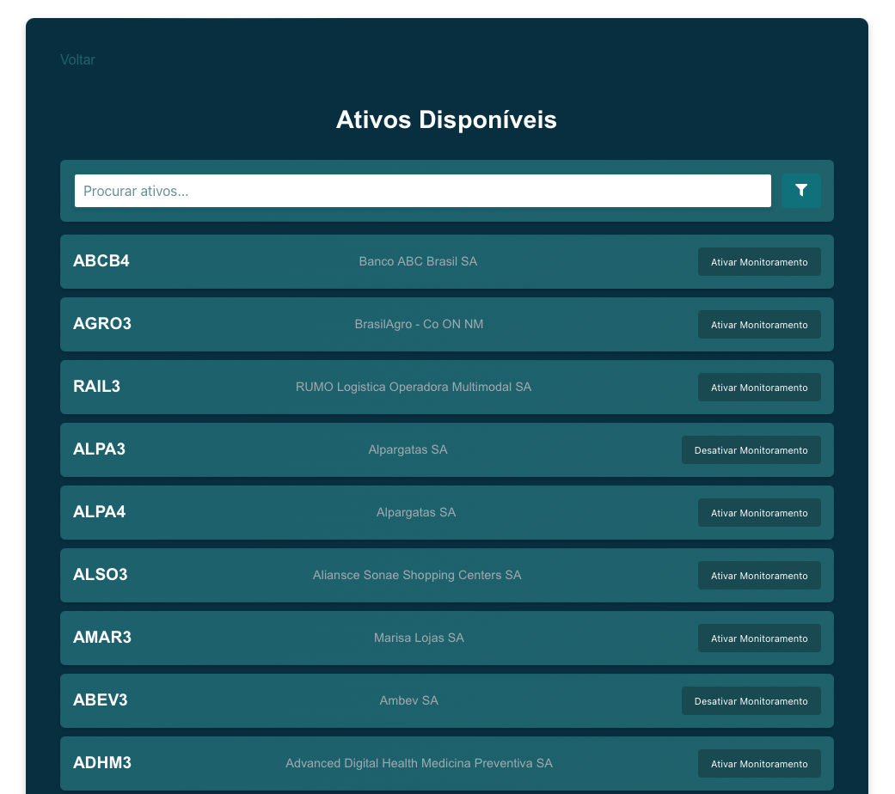
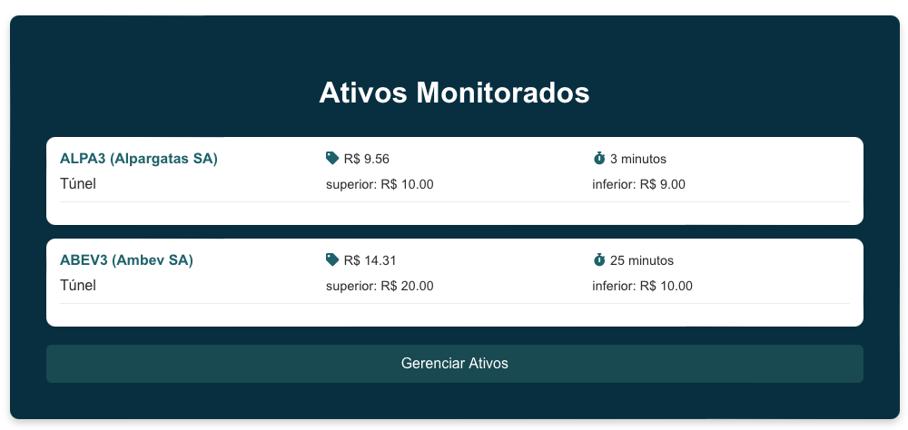
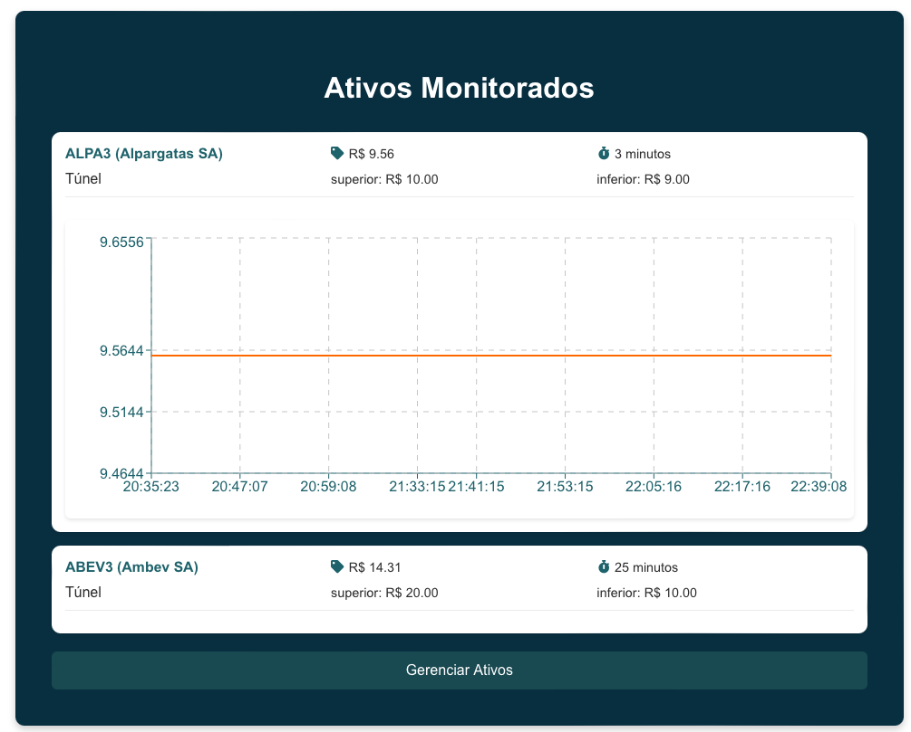
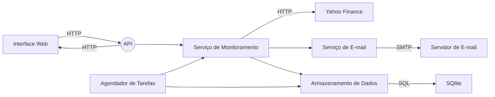

# Monitoramento de Ativos

## Descrição

O objetivo do sistema é auxiliar um investidor nas suas decisões de comprar/vender ativos. Para tal, o sistema deve registrar periodicamente a cotação atual de ativos da B3 e também avisar, via e-mail, caso haja oportunidade de negociação.

Os seguintes requisitos funcionais são necessários:
- Expor uma interface web para permitir que o usuário configure:
  - os ativos da B3 a serem monitorados;
  - os parâmetros de túnel de preço (www.b3.com.br/pt_br/solucoes/plataformas/puma-trading-system/para-participantes-e-traders/regras-e-parametros-de-negociacao/tuneis-de-negociacao) de cada ativo;
  - a periodicidade da checagem (em minutos) de cada ativo.
- O sistema deve obter e armazenar as cotações dos ativos cadastrados de alguma fonte pública qualquer, respeitando a periodicidade configurada por ativo.
- A interface web deve permitir consultar os preços armazenados dos ativos cadastrados.
- Enviar e-mail para o investidor sugerindo a compra sempre que o preço de um ativo monitorado cruzar o seu limite inferior do túnel, e sugerindo a venda sempre que o preço de um ativo monitorado cruzar o seu limite superior do túnel

## Screenshots

### Tela de ativos disponíveis



### Tela de ativos monitorados



### Tela de ativo monitorado com gráfico




## Como rodar o projeto

```bash
docker-compose up
```

Endereço da interface web: http://localhost:3000

[Postman Collection](./assets_monitor.postman_collection.json)

## Tecnologias

### Frontend
- HTML
- CSS
- JavaScript
- TypeScript
- React

### Backend
- Python
- Django
- Celery
- SQLite
- Docker
- Docker Compose

## Arquitetura



## TODO

- Melhorar docker-compose e adicionar frontend nele

## Futuras Melhorias

- Adicionar gerenciamento de usuários
- Adicionar autenticação e autorização
- Adicionar testes unitários e de integração
- Adicionar uma camada de cache com Redis
- Utilizar um banco de dados mais robusto, como o PostgreSQL
- Receber os dados dos ativos em tempo real, utilizando WebSockets ou até mesmo uma sessão FIX com a B3
- Melhorar validaçao de dados no backend
- Melhorar validaçao de dados no frontend
- Tornar frontend responsivo
